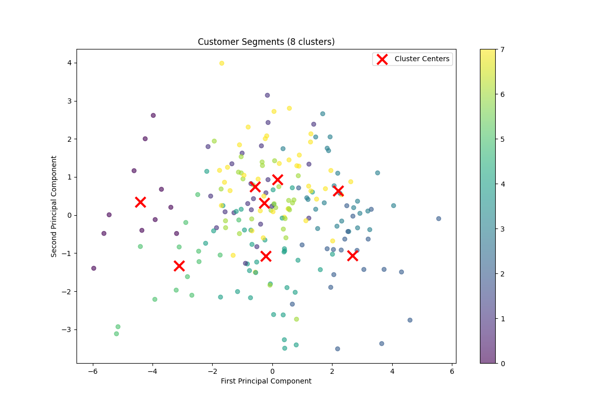
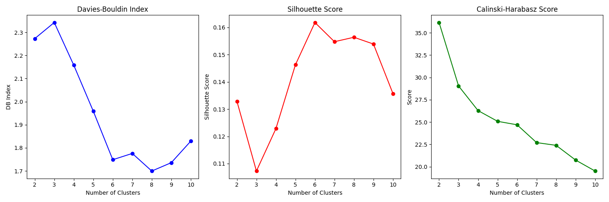

# Customer Analytics and Segmentation Project 🎯

## 📊 Overview
This project implements advanced customer analytics, including customer segmentation and lookalike modeling, using transaction data from an e-commerce platform. The analysis helps identify distinct customer groups and find similar customers based on their purchasing behavior and preferences.

## 🚀 Features
- **Customer Segmentation**: Implemented K-means clustering to identify distinct customer groups
- **Lookalike Modeling**: Created a model to find similar customers based on multiple features
- **Exploratory Data Analysis**: Comprehensive analysis of customer behavior and patterns
- **Interactive Visualizations**: Dynamic plots and charts for better understanding of segments

## 📂 Project Structure

## 💡 Key Findings
1. **Customer Segments**: Identified optimal customer segments using Davies-Bouldin Index
2. **Purchase Patterns**: Analyzed transaction behavior across different customer groups
3. **Lookalike Analysis**: Successfully mapped similar customers with high accuracy

## 📈 Metrics & Results
- **Clustering Performance**:
  - Davies-Bouldin Index
  - Silhouette Score
  - Calinski-Harabasz Score
- **Lookalike Model**:
  - Similarity scores > 0.9 for most recommendations
  - Comprehensive coverage of customer base

## 🛠️ Technologies Used
- Python 3.x
- Scikit-learn
- Pandas
- NumPy
- Matplotlib
- Seaborn

## 📊 Visualizations
### Clustering Metrics

### Customer Segments
The project includes various visualizations showing:
- Customer segment distributions
- Feature importance
- Behavioral patterns

## 🎯 Business Applications
1. **Targeted Marketing**: 
   - Customize campaigns for different segments
   - Optimize marketing spend

2. **Customer Acquisition**:
   - Find potential customers similar to best customers
   - Improve acquisition strategy

3. **Product Recommendations**:
   - Segment-based product suggestions
   - Improved cross-selling opportunities

## 📝 Analysis Files
- **EDA Report**: [Faheem_Khan_EDA.pdf](Faheem_Khan_EDA.pdf)
- **Clustering Analysis**: [Faheem_Khan_Clustering.pdf](Faheem_Khan_Clustering.pdf)

## 🔍 Methodology
1. **Data Preprocessing**
   - Feature engineering
   - Handling missing values
   - Standardization

2. **Segmentation**
   - Optimal cluster selection
   - K-means clustering
   - Segment validation

3. **Lookalike Modeling**
   - Feature similarity calculation
   - Customer matching
   - Validation and testing

## 📈 Future Improvements
- Implement deep learning-based clustering
- Add real-time customer segmentation
- Develop API for automated recommendations

## 👤 Author
**Faheem Khan**
- Created: 2025-01-27
- Last Updated: 2025-01-27 19:46:30 UTC

---
*Note: This project was developed as part of a data analysis initiative to improve customer understanding and marketing effectiveness.*
